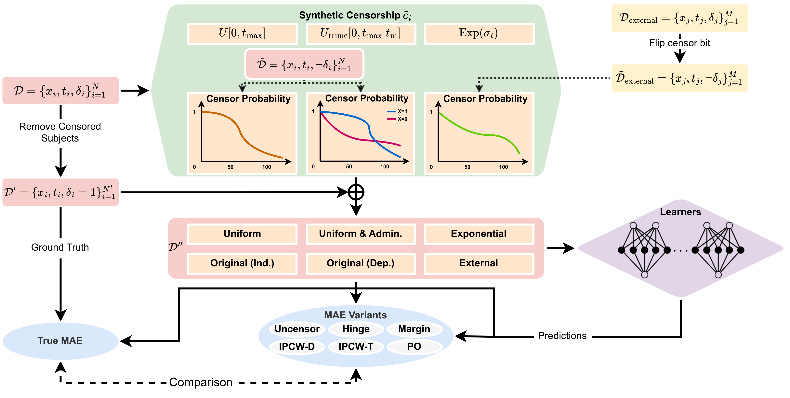

# CensoredMAE
Code Release for "An Effective Meaningful Way to Evaluate Survival Models" (Qi et al), ICML 2023. [Paper link](https://arxiv.org/abs/2306.01196)

One straightforward metric to evaluate a survival prediction model is based on the Mean Absolute Error
(MAE, aka L1-loss) -- the average of the absolute difference between the time predicted by the model and the 
true event time, over all subjects.
This paper proposes a novel approach for generating realistic semi-synthetic survival datasets
for evaluating the evaluation metrics. 
This paper also propose a MAE-based metric, `MAE-PO`,
that can handle censored data and demonstrated to be effective than other metrics. 

This repository contains the code for generating the semi-synthetic survival datasets (mostly in `data/__init__.py`).
and the code for the evaluation metrics (`MAE-Uncensored`, `MAE-Hinge`, `MAE-Margin`, `MAE-IPCW-T`, `MAE-IPCW-T`, 
`MAE-PO`) are in the submodule `SurvivalEVAL` (see also this [repo](https://github.com/shi-ang/SurvivalEVAL)).

|  | 
|:--:| 
| *Flowchart illustrating the generation of realistic semi-synthetic survival datasets and the subsequent evaluation of MAE metrics* |


## Requirements
- Pytorch>=0.4.0
- CPU or GPU
- Python>=3.7 (The code is tested on Python 3.9.6)
- Other packages can be installed with the following instruction:
```
$ pip install -r requirements.txt
```

## Quick start
### Make Folder/Packages as Source Code
Before running the code, please make sure that the `SurvivalEVAL` folder is treated as source code
- For Pycharm (or other IDEs)):
    - Right-click on the `SurvivalEVAL` folder
    - Select `Mark Directory as` -> `Sources Root`
- For terminal:
    - Add the following lines to your `~/.bashrc` file:
        ```
        export PYTHONPATH="${PYTHONPATH}:/your-path-to/SurvivalEVAL"
        ```
    - Run the following command:
        ```
        $ source ~/.bashrc
        ```

### Running the Code
Then you can run the code with the following command:
```
$ python main.py --dataset <dataset> --censor_dist <synthetic_censoring_type> --model <MTLR_or_CoxPH> --lr <learning_rate>
$ python run_baselines.py --dataset <dataset> --censor_dist <synthetic_censoring_type>
```
Otherwise, instead of doing the above, you can also run the bash script with the following command (and create a folder named `Figs` in the directory).
```
$ bash run.sh
```
Note: You can modify some parameters in `generate_parser()` method in `params.py` to get your own specific models.


### Running the SCA Model
Survival Cluster Analysis is implemented using TensorFlow 1.8.0, which requires Python 3.6 and thus not compatible with `SurvivalEVAL`.

To run the SCA model on the semi-synthetic datasets, you can create another conda environment (SCA environment) with the instruction from
[SCA Repo](https://github.com/paidamoyo/survival_cluster_analysis)

Then you can run the following command to run the SCA model using the SCA environment 
on the semi-synthetic datasets:
```
$ python run_SCA.py --dataset <dataset> --censor_dist <synthetic_censoring_type>
```
After the execution, you can find the prediction results in the `SCA/results` folder.
Now switch the environment from SCA environment to the default environment, 
and evaluate the results using the following command (using the same dataset and censoring type):
```
$ python run_baseline.py --dataset <dataset> --censor_dist <synthetic_censoring_type>
```


## Datasets
The datasets we tested in the paper are `GBM`, `SUPPORT`, `Metabric`, `MIMIC-A`, and `MIMIC-H`.

For `SUPPORT`, we directly download and process the data from the website, which can also be found in `data/__init__.py`.
And for `Metabric`, we already put the data in this repo, which can be found in `data/Metabric/Metabric.csv`.
That means user can directly run the code on the SUPPORT dataset.

For `GBM` and `MIMIC-A`, and `MIMIC-H`, we cannot directly provide the data due to the privacy issue.
If you are interested in using the `GBM` dataset you can request it via email contact to the author.

If you are interested in using the `MIMIC` dataset, you can access the MIMIC-IV data from the [MIMIC website](https://mimic.physionet.org/) under "Accessing MIMIC-IV v2.0", or directly access this [MIMIC-IV Version 2.0](https://physionet.org/content/mimiciv/2.0/).
1. For `MIMIC-A`, you first need to go through the ethic process, and once you have done that, you can go to the 
BigQuery and process the data using the json script `MIMIC_IV_V2.0.json` in the `data/MIMIC/` folder.
And further process the data using the code in `MIMIC_IV_V2.0_preprocess.py`.
2. For `MIMIC-H`, go through the same ethic process, and then use the code in `MIMIC_IV_hosp_failure.json` 
(also in the `data/MIMIC/` folder) to acquire the data from BigQuery. 
And further process the data using the code in `MIMIC_IV_hosp_failure.py`.
